# Guia do Usuário do Aplicativo de Dramas Curtos (Lado do Usuário)

> **Este tutorial é para:** Usuários regulares (que assistem a dramas curtos e compram assinaturas com moeda virtual)
> **Nome do Sistema:** Plataforma de Dramas Curtos ReelChain

---

## 📖 Índice

1. [O que é um aplicativo de dramas curtos?](#1-O-que-é-um-aplicativo-de-dramas-curtos)
2. [Como se cadastrar e fazer login？](#2-como-se-cadastrar-e-fazer-login)
3. [Como assistir a minidramas？](#3-como-assistir-a-minidramas)
4. [Como recarregar moedas de ouro？](#4-como-recarregar-moedas-de-ouro)
5. [Como comprar uma assinatura, episódio individual ou série completa？](#5-como-comprar-uma-assinatura-episódio-individual-ou-série-completa)
6. [Como ganhar dinheiro convidando amigos？](#6-como-ganhar-dinheiro-convidando-amigos)
7. [Como faço para sacar USDT e REEL?](#7-como-faco-para-sacar-usdt-e-reel)
8. [Resgate de pontos para REEL？](#8-resgate-de-pontos-para-reel)
9. [Perguntas frequentes？](#9-perguntas-frequentes)

---

## 1. O que é um aplicativo de dramas curtos

**Reelchain App** é um aplicativo móvel desenvolvido especificamente para assistir a séries curtas em vídeo. Assim como em séries de TV, cada episódio tem apenas alguns minutos de duração, perfeito para assistir em pequenos intervalos de tempo livre.

### Principais Recursos:
- 🎬 **Assista a Séries Curtas**: Uma vasta biblioteca de séries curtas, assista a qualquer hora e em qualquer lugar.

- 👑 **Serviço de Assinatura**: Adquira uma assinatura para assistir a todas as séries curtas gratuitamente.

- 🪙 **Recarga de Feijões de Ouro**: Use feijões de ouro para desbloquear episódios individuais, séries curtas completas ou adquirir assinaturas.

- 🤝 **Convide e Ganhe Comissões**: Ganhe comissões convidando amigos para se cadastrarem.

- ❤️ **Favoritos e Seguidores**: Salve suas séries curtas favoritas para assistir facilmente mais tarde.

- 🔄 **Resgate de Pontos**: Converta com eficiência seus pontos de atividade diária (pontos) em poder de compra na plataforma (moedas R).

---

## 2. Como se cadastrar e fazer login

### 2.1 Baixe o aplicativo
Primeiro, você precisa baixar o aplicativo de curtas-metragens para o seu celular:
- **Celulares Apple**: Procure o nome do aplicativo na App Store e baixe-o.
- **Celulares Android**: Instale através do link de download fornecido.

### 2.2 Registrar uma conta

O aplicativo oferece vários métodos de cadastro; escolha o mais conveniente:

<!--#### Método 1: Cadastrar com o número de celular (Recomendado)-->
<!--1. Abra o aplicativo e clique no botão "Entrar/Cadastrar"-->
<!--2. Digite seu **número de celular**-->
<!--3. Clique em "Obter código de verificação" e o sistema enviará um código de verificação para o seu celular via SMS-->
<!--4. Digite o **código de verificação** recebido-->
<!--5. Defina uma **senha de login** (para acessos futuros)-->
<!--6. Clique em "Cadastrar" para concluir-->

#### Método 1: Cadastro por e-mail
1. Acesse Minha Conta
    <figure style="margin-bottom: 10rem;">
     
    </figure>
   
2. Clique em Configurações
    <figure style="margin-bottom: 10rem;">
     
    </figure>
   
3. Selecione "Cadastrar com e-mail"
    <figure style="margin-bottom: 10rem;">
     
    </figure>

4. Clique em **Inscreva-se agora**
    <figure style="margin-bottom: 10rem;">
     
    </figure>

5. Insira seu **endereço de e-mail**
    <figure style="margin-bottom: 10rem;">
     
    </figure>

6. Insira o **código de verificação**
    <figure style="margin-bottom: 10rem;">
     
    </figure>

7. Digite sua **nova senha** e **confirme a senha**.
    <figure style="margin-bottom: 10rem;">
     
    </figure>
   
8. Insira o **código de convite** (Se você já possui um código de convite, não precisa preenchê-lo).
    <figure style="margin-bottom: 10rem;">
     
    </figure>

9. Clique em **Inscreva-se agora** para concluir o cadastro.
    <figure style="margin-bottom: 10rem;">
     
    </figure>

10. Clique em **Senha da conta** para fazer login.
<figure style="margin-bottom: 10rem;">
     
    </figure>

11. Digite seu **nome de usuário, senha** e pressione **Enter** para fazer login.
<figure style="margin-bottom: 10rem;">
     
    </figure>

12. Vincule o seu **Número de telefone**
<figure style="margin-bottom: 10rem;">
     
    </figure>

13. Após efetuar o login, você será direcionado para a **página inicial**.
<figure style="margin-bottom: 10rem;">
     
    </figure>

#### Método 2: Login com conta de terceiros (Mais rápido) Suporta os seguintes métodos de login rápido:

- **Login com conta do Google** (Google)
     1. Insira Meu
          <figure style="margin-bottom: 10rem;">
          
          </figure>
     
     2. Clique em Configurações
          <figure style="margin-bottom: 10rem;">
          
          </figure>
     
     3. Selecione **Fazer login com o Google** para entrar na conta de terceiros do Google.
          <figure style="margin-bottom: 10rem;">
          
          </figure>

     4. Vincule o seu **Número de telefone**
          <figure style="margin-bottom: 10rem;">
          
          </figure>

     5. Após efetuar o login, você será redirecionado para a **página inicial**.
          <figure style="margin-bottom: 10rem;">
          
          </figure>
   
💡 **Dica:** Após fazer login com uma conta de terceiros, o sistema solicitará que você vincule seu número de celular para maior segurança.

---

## 3. Como assistir a minidramas

### 3.1 Navegando por Dramas Curtos Após abrir o aplicativo, você verá 4 abas principais (barra de navegação inferior):
<figure style="margin-bottom: 10rem;">
     
    </figure>

#### 🏠 Página Inicial

- **Vídeos Curtos Recomendados**: O sistema exibirá vídeos interessantes nas recomendações.
<figure style="margin-bottom: 10rem;">
     
    </figure>

- **Espaço para banner publicitário**: Exibição em carrossel de séries curtas populares
<figure style="margin-bottom: 10rem;">
     
    </figure>

- **Filtragem por categoria**: Busque por séries curtas por gênero (suspense, romance, etc.)
<figure style="margin-bottom: 10rem;">
     
    </figure>

- **Busque por minisséries** e **Ranking de Popularidade**: As minisséries mais populares
<figure style="margin-bottom: 10rem;">
     
    </figure>

<figure style="margin-bottom: 10rem;">
     
    </figure>

#### 📺 Recomendação

- Modo de streaming de vídeo: assista a dramas curtos como se estivesse navegando pelo TikTok.
- Deslize para cima e para baixo para alternar entre diferentes clipes de dramas curtos.
<figure style="margin-bottom: 10rem;">
     
    </figure>

#### ⭐ Assista a séries de TV

- Todas as minisséries que você está assistindo estão aqui (suas minisséries salvas)
- Encontre facilmente o último episódio que você assistiu
<figure style="margin-bottom: 10rem;">
     
    </figure>

#### 👤 Minhas

- **Informações Pessoais**
<figure style="margin-bottom: 10rem;">
     
    </figure>

- **Status de membro**
<figure style="margin-bottom: 10rem;">
     
    </figure>

- Saldo da Carteira: **Ver Grãos de Ouro restantes**
<figure style="margin-bottom: 10rem;">
     
    </figure>

   <figure style="margin-bottom: 10rem;">
        
       </figure>

- Detalhes do saldo: Veja os motivos do **aumento ou diminuição de Feijões de Ouro**
<figure style="margin-bottom: 10rem;">
        
       </figure>

   <figure style="margin-bottom: 10rem;">
        
       </figure>

- Histórico de visualização: **Encontre rapidamente os programas que você assistiu da última vez.**
<figure style="margin-bottom: 10rem;">
     
    </figure>

- Convide amigos: Clique em **Salvar código QR** e envie para seus amigos.
<figure style="margin-bottom: 10rem;">
     
    </figure>

### 3.2 Passos para Assistir a um Curta-Metragem

#### Passo 1: Selecione um Curta-Metragem
1. Encontre seu curta-metragem favorito na página inicial.
2. Clique na imagem de capa do curta-metragem.
3. Acesse a **página de detalhes do curta-metragem**.
#### Passo 2: Veja os Detalhes
Na página de detalhes, você poderá ver:

- **Introdução ao Curta-Metragem**: Sinopse
<figure style="margin-bottom: 10rem;">
     
    </figure>

- **Lista de Episódios**: Todos os episódios, por exemplo, episódios 1-100
<figure style="margin-bottom: 10rem;">
     
    </figure>

<figure style="margin-bottom: 10rem;">
     
    </figure>

- **Botão Favoritar/Compartilhar**
<figure style="margin-bottom: 10rem;">
     
    </figure>

Passo 3: Selecione um episódio para assistir
- Clique em um episódio, como "Episódio 1"
- Acesse a página de reprodução e comece a assistir

### 3.3 Visualização gratuita vs. visualização paga

#### Gratuito para assistir:
- Os primeiros episódios de cada minissérie são **gratuitos** (geralmente os primeiros 1 a 10 episódios).
- Você pode assistir aos episódios gratuitos primeiro e, se gostar, decidir se deseja pagar.

Visualização paga: Os episódios posteriores exigem pagamento, e existem duas opções:
1. **Adquira uma assinatura**: A assinatura permite que você assista a todos os episódios curtos gratuitamente (Recomendado!)
<figure style="margin-bottom: 10rem;">
     
    </figure>

2. **Desbloqueie com Feijões de Ouro**: Compre um único episódio.
<figure style="margin-bottom: 10rem;">
     
    </figure>

3. **Desbloqueie com Feijões de Ouro**: A série completa
<figure style="margin-bottom: 10rem;">
     
    </figure>

---

## 4. Como recarregar moedas de ouro
Se você não quiser comprar uma assinatura, pode recarregar com moedas de ouro e usá-las para desbloquear episódios individuais de minisséries.
<figure style="margin-bottom: 10rem;">
     
    </figure>

<figure style="margin-bottom: 10rem;">
     
    </figure>

### 4.1 Passos para Recarregar Grãos de Ouro

Passo 1: Acesse a página de recarga
1. Clique na aba "Meu"
2. Clique em "Carteira" ou "Saldo Gold Bean"
3. Clique no botão "Recarregar"
<figure style="margin-bottom: 10rem;">
     
    </figure>

<figure style="margin-bottom: 10rem;">
     
    </figure>

#### Passo Dois: Escolha um Pacote de Recarga
O sistema oferece diversos pacotes de Grãos de Ouro:
- 💰 10 Grãos de Ouro = $9,90
- 💰 22 Grãos de Ouro = $19,90
- 💰 53 Grãos de Ouro = $49,90
- 💰 255 Grãos de Ouro = $199,90

💡 **Dica:** Quanto maior o valor, mais Grãos de Ouro você receberá.

Passo 3: Compra com Moedas de Ouro
- Escolha o método de pagamento (o mesmo da compra para membros)
- Conclua o pagamento
- As Moedas de Ouro serão creditadas em sua conta imediatamente

### 4.2 Assistindo com Feijões de Ouro
1. Assista aos episódios que exigem pagamento.
2. Mensagem do sistema: "Requer XX Feijões de Ouro para desbloquear."
3. Clique em "Desbloquear com Feijões de Ouro".
4. Os Feijões de Ouro serão deduzidos automaticamente e o episódio será desbloqueado com sucesso.

---

## 5. Como comprar uma assinatura, episódio individual ou série completa

1. **Adquira uma assinatura**: A assinatura permite que você assista a todos os episódios curtos gratuitamente (Recomendado!)
<figure style="margin-bottom: 10rem;">
     
    </figure>

2. **Desbloqueie com Feijões de Ouro**: Compre um único episódio.
<figure style="margin-bottom: 10rem;">
     
    </figure>

3. **Desbloqueie com Feijões de Ouro**: A série completa
<figure style="margin-bottom: 10rem;">
     
    </figure>

---
## 6. Como ganhar dinheiro convidando amigos
- O dinheiro ganho ao convidar amigos pode ser sacado para sua própria conta.
- For each first-level invited friend who purchases a membership, you will receive a commission equal to 20% of their payment.
- A 5% commission is awarded based on the membership subscription amount paid by your second-level referrals.
- Existem duas maneiras de convidar amigos, veja abaixo:
- Compartilhe seu link de convite

### Compartilhe através do link
1、 Clique no link Compartilhar para obter seu próprio link de convite.
     <figure style="margin-bottom: 10rem;">
               
     </figure>

2、 Clique no botão "Copiar link" para copiar seu próprio link de convite.
     <figure style="margin-bottom: 10rem;">
               
     </figure>

3、Envie o link do convite copiado para seus amigos para que eles se cadastrem.

### Compartilhe seu pôster e deixe seus amigos escanearem o código QR para se cadastrarem.
1、 Clique em Salvar o cartaz para obter seu pôster de convite.
     <figure style="margin-bottom: 10rem;">
               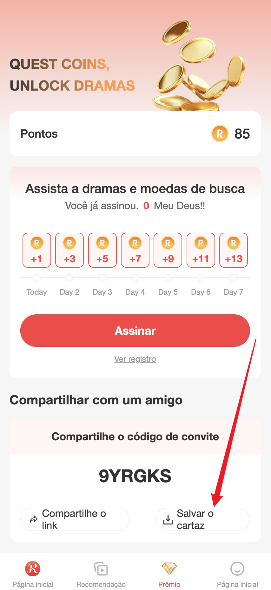
     </figure>

2、 Após receber o pôster do convite, faça uma captura de tela e compartilhe com seus amigos.
     <figure style="margin-bottom: 10rem;">
               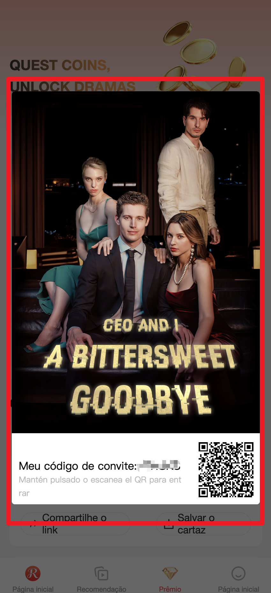
     </figure>

3、Peça aos seus amigos que escaneiem o código QR no cartaz do convite.

---

## 7. como faco para sacar usdt e reel 
### Somente membros podem sacar fundos! ! !
### Retirar USDT（Meus ganhos são em USDT）
1. Clique para acessar a função de saque.
<figure style="margin-bottom: 10rem;">
     
    </figure>

2. Clique para acessar a página onde você pode selecionar a moeda que deseja sacar.
<figure style="margin-bottom: 10rem;">
     
    </figure>

3. Selecione USDT
<figure style="margin-bottom: 10rem;">
     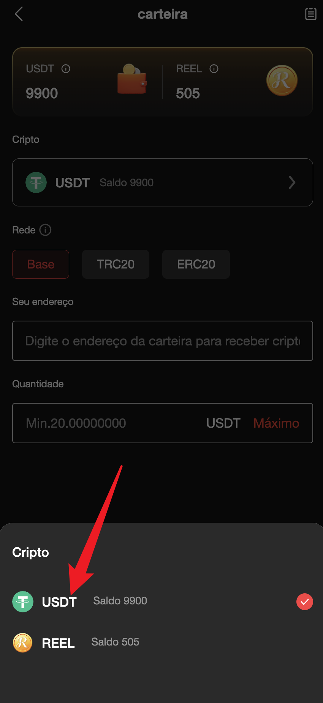
    </figure>

4. Redes de comutação
<figure style="margin-bottom: 10rem;">
     
    </figure>

5. Insira o endereço de recebimento do USDT
<figure style="margin-bottom: 10rem;">
     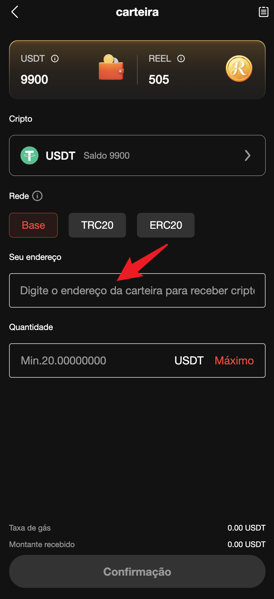
    </figure>

6. Insira o valor que deseja sacar.（Valor mínimo para saque: 100 USDT）
<figure style="margin-bottom: 10rem;">
     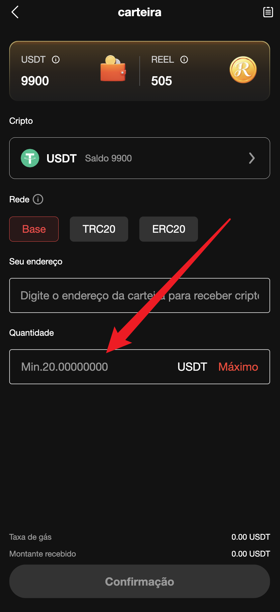
    </figure>

7. Após retirada bem-sucedida, aguardando revisão.
<figure style="margin-bottom: 10rem;">
     
    </figure>
<figure style="margin-bottom: 10rem;">
     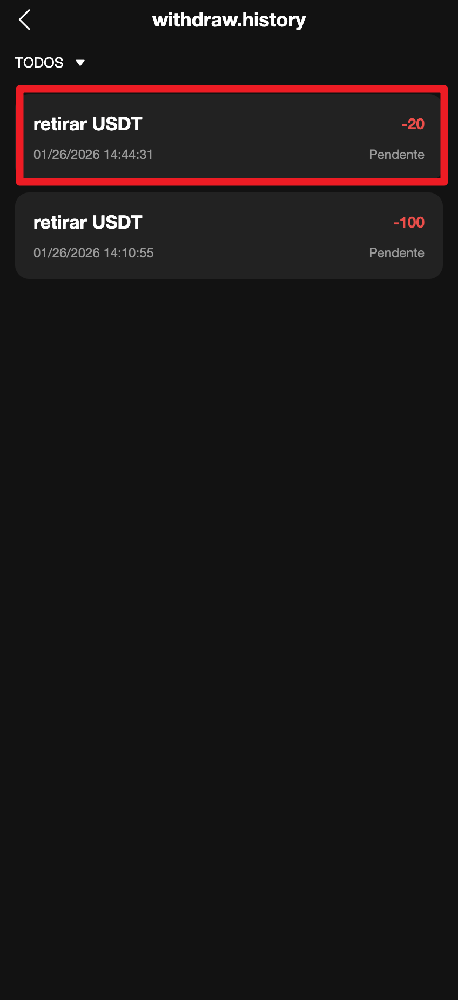
    </figure>

### Retirar REEL（Os pontos podem ser trocados por REEL）
1. Clique para acessar a função de saque.
<figure style="margin-bottom: 10rem;">
     
    </figure>

2. Clique para acessar a página onde você pode selecionar a moeda que deseja sacar.
<figure style="margin-bottom: 10rem;">
     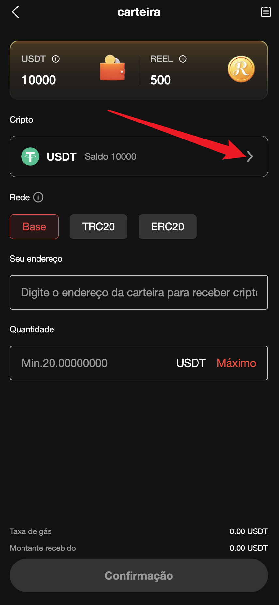
    </figure>

3. Selecione REEL
<figure style="margin-bottom: 10rem;">
     
    </figure>

4. Redes de comutação
<figure style="margin-bottom: 10rem;">
     
    </figure>

5. Insira o endereço de recebimento do REEL
<figure style="margin-bottom: 10rem;">
     
    </figure>

6. Insira o valor que deseja sacar.（Valor mínimo para saque: 100 REEL
<figure style="margin-bottom: 10rem;">
     
    </figure>

7. Verifique cuidadosamente o endereço de saque para garantir que esteja correto.
<figure style="margin-bottom: 10rem;">
     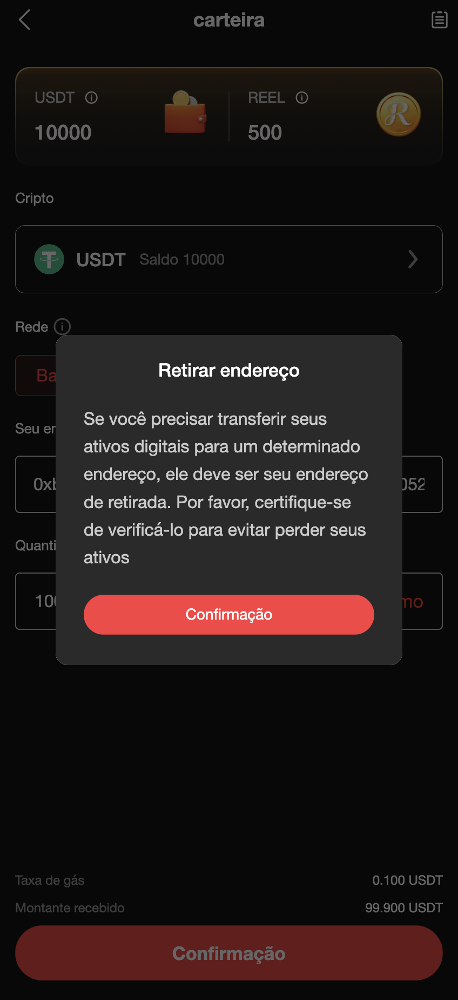
    </figure>
    
<figure style="margin-bottom: 10rem;">
     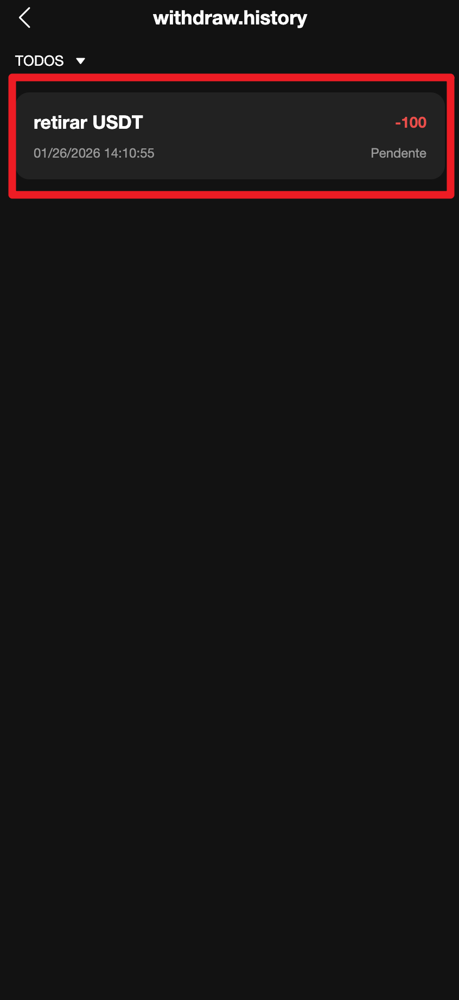
    </figure>

---

##  8. Resgate de pontos para REEL
### Taxa de conversão de pontos para REEL: 200 pontos = 1 REEL
1. Clique na seta para acessar o resgate de pontos.
<figure style="margin-bottom: 10rem;">
     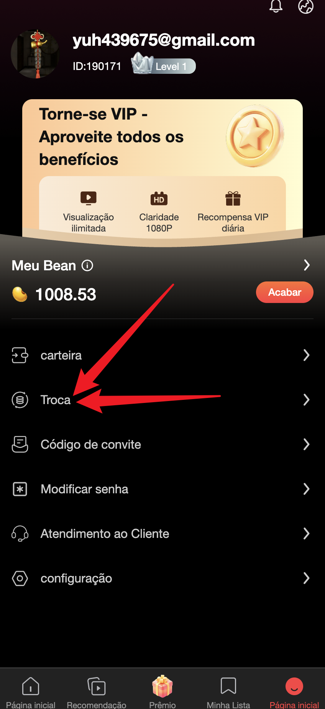
    </figure>

2. Veja os pontos disponíveis no momento.
<figure style="margin-bottom: 10rem;">
     
    </figure>

3. Insira os pontos a serem consumidos.
<figure style="margin-bottom: 10rem;">
     
    </figure>

4. A quantidade de REEL trocada será exibida automaticamente aqui.
<figure style="margin-bottom: 10rem;">
     
    </figure>

5. Clique em confirmar para enviar
<figure style="margin-bottom: 10rem;">
     
    </figure>

6. Notificação de resgate bem-sucedido
<figure style="margin-bottom: 10rem;">
     
    </figure>

### Veja os detalhes do resgate 
1. Acesse a página de check-in.
<figure style="margin-bottom: 10rem;">
     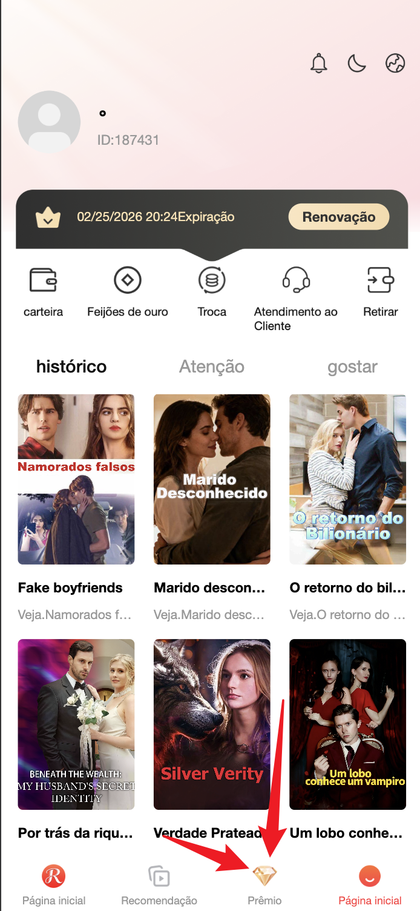
    </figure>

2. Acesse a página de check-in.
<figure style="margin-bottom: 10rem;">
     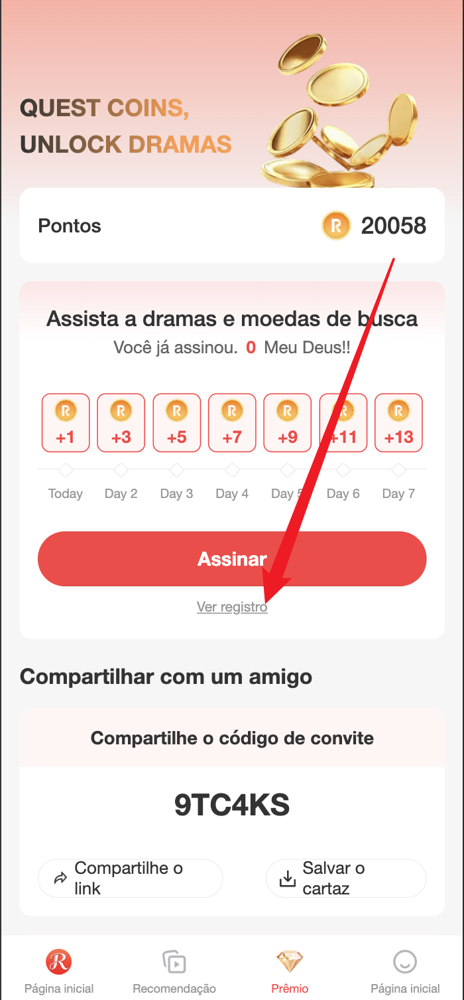
    </figure>

3. Acesse a página de check-in.
<figure style="margin-bottom: 10rem;">
     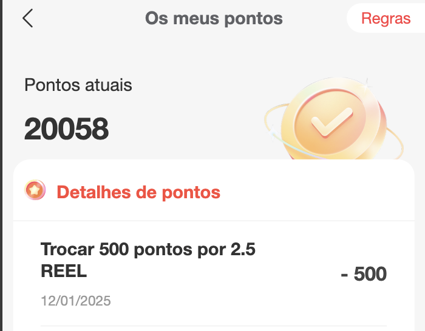
    </figure>

### Verifique o número atual de REEL.
1. Clique para acessar a função de saque.
<figure style="margin-bottom: 10rem;">
     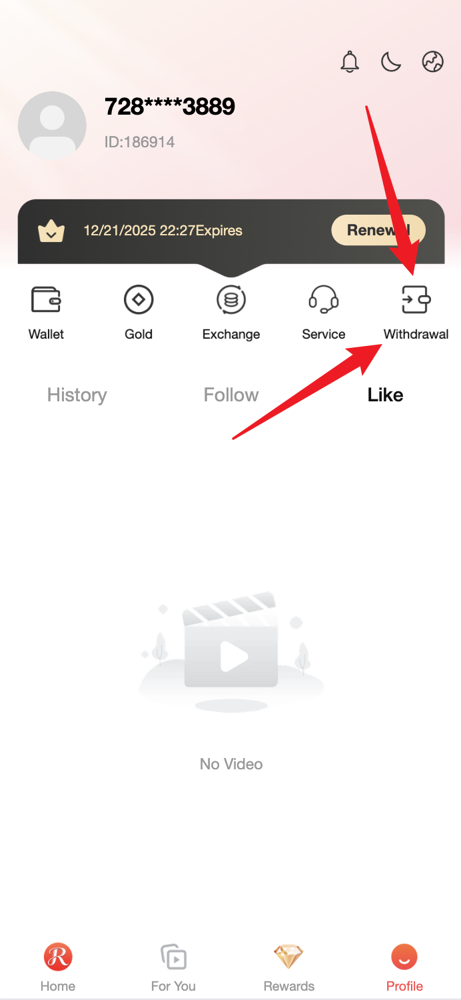
    </figure>

2. Clique para acessar a página onde você pode selecionar a moeda que deseja sacar.
<figure style="margin-bottom: 10rem;">
     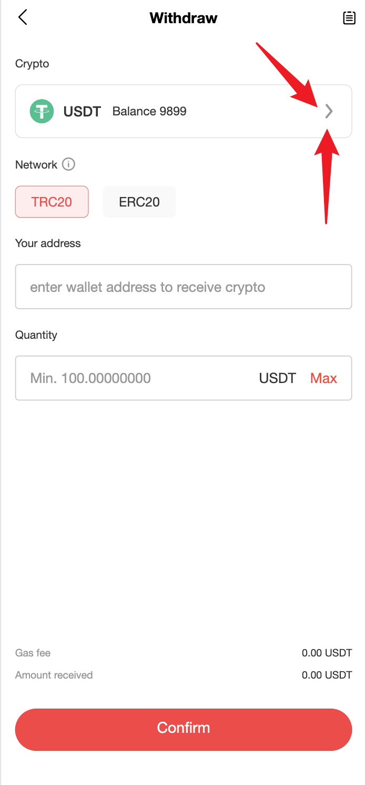
    </figure>

3. A área circulada em vermelho representa a quantidade atual.
<figure style="margin-bottom: 10rem;">
     
    </figure>

---

## 9. Perguntas frequentes

### P1: O que devo fazer se não receber o código de verificação durante o cadastro?
**R:**
- Verifique se o seu número de telefone foi digitado corretamente.
- Verifique se o seu SMS foi bloqueado (verifique a pasta "Spam/Lixo Eletrônico").
- Aguarde de 1 a 2 minutos; o código de verificação pode demorar um pouco para chegar.
- Tente se cadastrar com o seu endereço de e-mail.
- Entre em contato com o atendimento ao cliente para obter ajuda.

### P2: Ainda preciso de Moedas de Ouro depois de comprar uma assinatura?
**R:**
- Não! Os membros podem assistir a todos os dramas curtos gratuitamente.
- Você pode escolher entre Moedas de Ouro ou uma assinatura.
- Recomendação: Para usuários que assistem a dramas curtos com frequência, uma assinatura é mais vantajosa.

### P3: Como faço para continuar assistindo a um curta-metragem se eu estiver na metade?
**R:**
- O sistema gravará automaticamente seu progresso de visualização.
- Na próxima vez que você abrir o curta-metragem, a reprodução será retomada de onde você parou.
<figure style="margin-bottom: 10rem;">
     
    </figure>

### P4: Como faço para salvar meus dramas curtos favoritos?
**R:**
1. Acesse a página de detalhes do drama curto.
<figure style="margin-bottom: 10rem;">
     
    </figure>

2. Clique no botão "Favoritos" (ícone ⭐)
<figure style="margin-bottom: 10rem;">
     
    </figure>

3. Os dramas curtos salvos podem ser visualizados em "Meus → Favoritos".
<figure style="margin-bottom: 10rem;">
     
    </figure>

### P5: O que devo fazer se não conseguir assistir a dramas curtos/se a reprodução apresentar falhas?
**Resposta:**
- Verifique sua conexão de internet (recomenda-se o uso de Wi-Fi)
- Altere a qualidade do vídeo (clique nas configurações do player)
- Reinicie o aplicativo e tente novamente
- Atualize o aplicativo para a versão mais recente
- Entre em contato com o atendimento ao cliente para enviar seu feedback

### P6: Meu amigo convidado não vinculou meu código de convite?
**R:**
- Seu amigo precisa inserir o código de convite durante o cadastro.
- Se você se esqueceu de inseri-lo durante o cadastro:
1. Acesse "Minhas → Configurações"
2. Encontre "Vincular Convidado"
3. Insira seu código de convite
4. Confirme a vinculação

### P7: Como faço para entrar em contato com o atendimento ao cliente?
**R:**
1. Acesse a página "Meus" clientes.
<figure style="margin-bottom: 10rem;">
     
    </figure>

2. Clique em "Central de Ajuda" ou "Atendimento ao Cliente Online".
<figure style="margin-bottom: 10rem;">
     
    </figure>

3. Você pode visualizar as perguntas frequentes (as informações circuladas na última imagem são clicáveis).
<figure style="margin-bottom: 10rem;">
     
    </figure>

<figure style="margin-bottom: 10rem;">
     
    </figure>

### P8: Posso obter um reembolso?
**R:**
- Bens virtuais (assinaturas, moedas virtuais) geralmente não são passíveis de reembolso.

### P9: Como a segurança da conta é garantida?
**R:**
- Crie uma senha complexa (não use datas de aniversário, números como 123456, etc.)
- Não compartilhe a senha da sua conta com outras pessoas
- Vincule seu número de celular e endereço de e-mail para facilitar a recuperação da senha
- Troque sua senha regularmente

### P10: Como cancelo minha conta?
**Resposta:**
1. Acesse "Minha conta → Configurações"
<figure style="margin-bottom: 10rem;">
     
    </figure>

2. Localize "Cancelamento de conta"
<figure style="margin-bottom: 10rem;">
     
    </figure>

3. Leia as instruções de cancelamento.
<figure style="margin-bottom: 10rem;">
     
    </figure>

4. Confirme o cancelamento (Observação: os dados não poderão ser recuperados após o cancelamento).
<figure style="margin-bottom: 10rem;">
     
    </figure>

---

## 📞 Entre em contato conosco

- **Atendimento ao Cliente Online:** Dentro da "Central de Ajuda" do aplicativo
<figure style="margin-bottom: 10rem;">
     
    </figure>

<figure style="margin-bottom: 10rem;">
     
    </figure>

- **Serviço de atendimento ao cliente do Telegram**：https://t.me/ReelChainCustomer1
- **Atendimento ao cliente via WhatsApp**：https://whatsapp.com/channel/0029VbBPipV65yD51tf0iU3n

---

## 🎉 Conclusão

Parabéns! Agora você sabe como usar o aplicativo de minisséries:
- ✅ Cadastre-se e faça login
- ✅ Assista a minisséries
- ✅ Compre uma assinatura/Recarregue moedas de ouro

[//]: # (- ✅ 邀请好友赚钱)

[//]: # (- ✅ 提现收益)

Aproveite a visualização! E que você ganhe ainda mais dinheiro compartilhando! 🎬💰

---

**Informações da versão:** v1.0
**Data da atualização:** 13 de novembro de 2025
**Versões compatíveis:** ReelChain Short Drama App v7.0+

